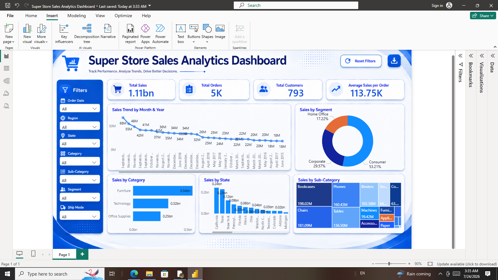
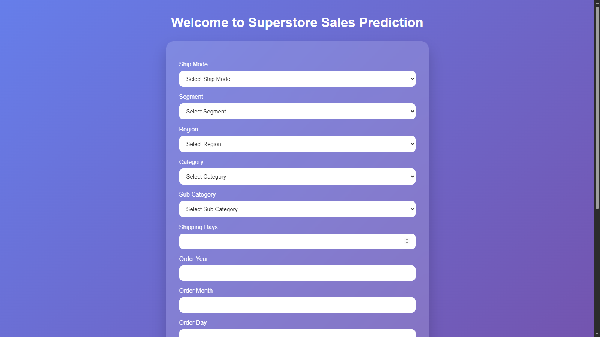
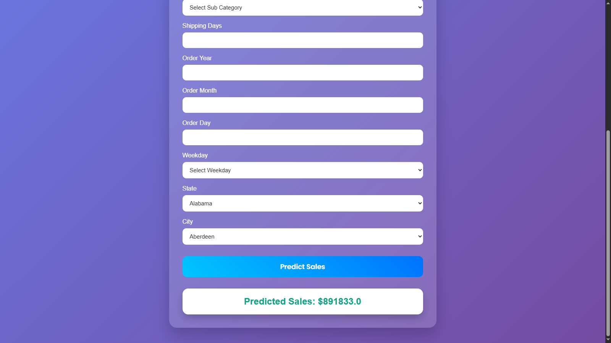

# 📊 Super Store Sales Analytics

An end-to-end Data Analytics & Machine Learning project that predicts Super Store sales using a Machine Learning model, provides predictions through a Flask web application, and delivers interactive business insights with a Power BI dashboard.

---

## 📌 Project Highlights

- 🤖 Machine Learning Sales Prediction
- 🌐 Flask Web Application
- 📊 Interactive Power BI Dashboard
- 📈 Business KPI Analysis
- 🧹 Data Cleaning & Feature Engineering
- 📉 Sales Trend Analysis
- 🎯 Interactive Filters & Slicers
- 📂 Well-Organized Project Structure

---

# 📸 Project Preview

## 📊 Power BI Dashboard



---

## 🌐 Flask Web Application

### Home Page



### Prediction Result



---

# 🚀 Features

### 🤖 Machine Learning

- Sales Prediction Model
- Data Preprocessing
- Feature Engineering
- Model Serialization using Pickle
- Prediction Pipeline

### 🌐 Flask Web Application

- User-Friendly Interface
- Real-Time Sales Prediction
- Responsive Design
- Clean UI using HTML & CSS

### 📊 Power BI Dashboard

- Total Sales KPI
- Total Orders KPI
- Total Customers KPI
- Average Sales KPI
- Sales Trend Analysis
- Sales by Category
- Sales by Segment
- Sales by Region
- Interactive Filters & Slicers

---

# 🛠 Tech Stack

### Programming

- Python

### Libraries

- Pandas
- NumPy
- Scikit-learn
- Pickle

### Web Development

- Flask
- HTML5
- CSS3

### Data Visualization

- Microsoft Power BI

---

# 📂 Project Structure

```text
SuperStore-Sales-Analytics/
│
├── dataset/
│   └── Superstore Sales Dataset.csv
│
├── model/
│   ├── Store_Sales_Data.pkl
│   ├── scaler.pkl
│   ├── encoder.pkl
│   └── features.pkl
│
├── notebook/
│   └── Sales_Prediction.ipynb
│
├── PowerBI/
│   ├── Super Store Sales Analytics Dashboard.pbix
│   └── Super Store Sales Analytics Dashboard.pdf
│
├── screenshots/
│   ├── Flask/
│   │   ├── flask_home.png
│   │   └── prediction_result.png
│   │
│   └── PowerBI/
│       ├── dashboard_overview.png
│       ├── sales_trend_by_month_year.png
│       ├── sales_by_segment.png
│       ├── sales_by_category.png
│       ├── sales_by_region.png
│       ├── filters_category.png
│       └── multiple_filters.png
│
├── static/
│   └── style.css
│
├── templates/
│   ├── index.html
│   ├── about.html
│   └── result.html
│
├── app.py
├── requirements.txt
└── README.md
```

---

# 📈 Machine Learning Workflow

- Data Collection
- Data Cleaning
- Feature Engineering
- Feature Scaling
- Model Training
- Model Evaluation
- Model Serialization
- Flask Deployment

---

# 📊 Dashboard Insights

The interactive Power BI dashboard helps users analyze:

- Monthly Sales Trends
- Sales by Region
- Sales by Category
- Sales by Segment
- Customer Insights
- Business Performance
- Interactive Filtering

---

# 📓 Colab Notebook

The complete Machine Learning workflow is available in the notebook.

👉 **Notebook:** `https://colab.research.google.com/drive/1ZrG_7IsDXuh5wNgCGnUCVEaB3NIORlvW`

---

# ⚙️ Installation

### Clone Repository

```bash
git clone YOUR_REPOSITORY_LINK
```

### Open Project

```bash
cd SuperStore-Sales-Analytics
```

### Install Dependencies

```bash
pip install -r requirements.txt
```

### Run Flask Application

```bash
python app.py
```

---

# 📌 Future Enhancements

- Deploy on Render
- Cloud Integration
- Improve Model Accuracy
- SQL Database Support
- Real-Time Data Analysis
- Advanced Machine Learning Models

---

# 👨‍💻 Author

**Vikas Singh Thakur**

🔗 GitHub: https://github.com/vikasdangi256

🔗 LinkedIn: YOUR_LINKEDIN_PROFILE

---

# ⭐ Support

If you found this project helpful, please consider giving it a ⭐ on GitHub.

Your support motivates me to build more Machine Learning and Data Analytics projects.
